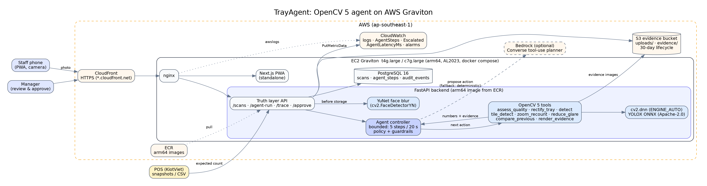
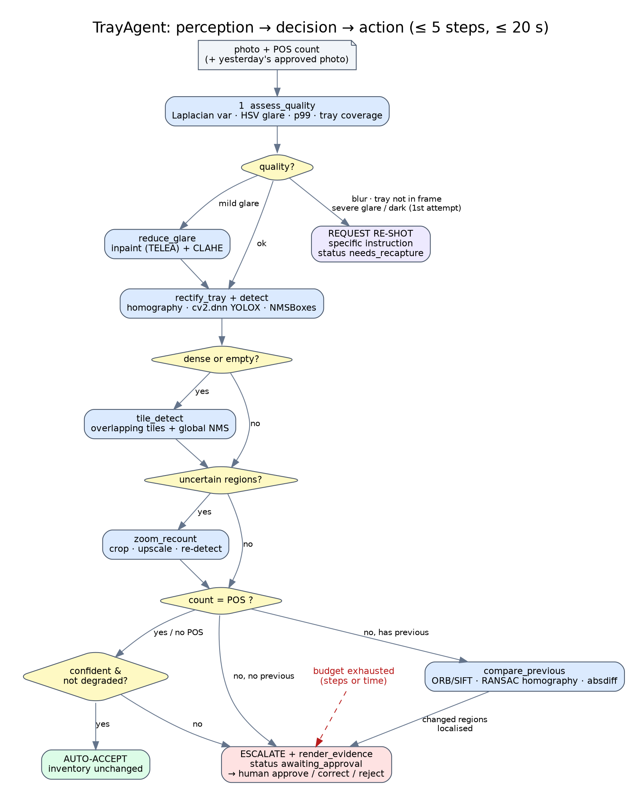

# TrayAgent: verified jewelry tray counts with an OpenCV 5 agent on AWS Graviton

OpenCV AI Competition 2026 (powered by AWS). Technical report.
Repository: `aistockcounting` (branch `claude/relaxed-wozniak-nhlyvm`, acting as `opencv-comp`).

> **Status of this report (2026-09-25).** Everything below describes built and tested
> software. The **evaluation numbers are not in yet**: they will come only from the
> frozen test set of the store's real tray photos (Section 6). Until those photos
> are labelled, this report contains no accuracy, latency-on-Graviton or COOL
> figures. Synthetic test fixtures are used only in unit tests and are never
> reported as results.

## 1. Problem

Jewelry stores count every display tray every day. Today staff photograph each tray,
count by eye, write the number on the photo, post it to a chat group and type it into
a sheet. The process is slow, error-prone and poor at catching shrink.

A single-shot detector does not solve this. Tray photos are adversarial for vision:
- gold and silver produce specular glare that hides items;
- handheld phones blur;
- trays are dense with small, look-alike items;
- empty velvet slots look like items.

Most importantly, **a wrong automatic count is worse than no count**, because it
silently changes inventory. The real task is therefore a *decision*: is this count
trustworthy? If not, what is the cheapest way to make it trustworthy (a better photo,
a closer look, a comparison with yesterday), or should a human decide?

## 2. Users

| User | Needs | What TrayAgent gives them |
|---|---|---|
| Store staff (primary; phone, not technical) | Count a tray in seconds; know exactly what to fix when a photo is bad | A mobile PWA with a live agent timeline and specific re-shot instructions ("tilt the phone about 15° away from the light") |
| Manager / auditor | Decide only the hard cases, with evidence | A review queue with a before/after view, uncertain regions, a diff against the last approved photo, and approve / correct / reject |
| Owner | Shrink visibility and an audit trail | A discrepancy inbox (the existing truth layer), with every agent decision in `audit_events` |

## 3. Architecture

- **Frontend:** a Next.js 14 PWA (mobile-first, accessible) with a live agent timeline
  (it polls `GET /scans/{id}/trace`) and a review page.
- **Backend:** FastAPI (async SQLAlchemy, Alembic) on the existing *inventory truth
  layer*. `create_scan`, `_upsert_discrepancy`, `_severity`, `review_scan` and
  `AuditEvent` are kept and extended, not replaced. New routes:
  - `POST /scans/{id}/agent-run`
  - `GET /scans/{id}/trace`
  - `POST /scans/{id}/approve`
- **New scan statuses:** `needs_recapture`, `awaiting_approval` and `superseded`
  (a re-shot links to the scan that asked for it through `parent_scan_id`).
- **Agent** (`backend/app/agent/`):
  - a deterministic **policy** (`policy.py`) with guardrails;
  - a bounded **controller** (`controller.py`: ≤ 5 steps, ≤ 20 s);
  - an optional **Bedrock planner** (`planner.py`);
  - **trace persistence** (`trace.py`): one `agent_steps` row per tool call (tool,
    inputs, outputs, evidence key, decision, reason, latency, planner) and an
    `AuditEvent` per decision.
- **Storage:** PostgreSQL 16 and S3 (MinIO locally). Evidence images are stored under
  `evidence/<scan>/<run>/NN_tool.jpg`.

### Agent workflow

The policy (SPEC §4.4) is a pure function of the numbers the OpenCV tools produced
so far:

1. `assess_quality`. A tray that is not in frame, a blurred photo, or severe glare or
   darkness on the first attempt leads to **request a re-shot** with a specific
   instruction. Mild glare leads to `reduce_glare`.
2. `rectify_tray` + `detect`.
3. If the tray is dense, or the single shot found nothing, run `tile_detect`.
4. If there are uncertain regions (confidence in [0.25, 0.5), or tile cells where tiling
   found fewer items), run `zoom_recount`.
5. If the count differs from POS and an approved previous photo exists, run
   `compare_previous`.
6. **Auto-accept** only if all of these hold:
   - the count equals POS (or there is no POS figure);
   - no uncertain region is left;
   - no single-shot/tiled view conflict;
   - mean confidence ≥ 0.6;
   - image quality is not degraded.

   Otherwise **escalate** with an annotated evidence sheet.

Budget exhaustion (steps or time) always escalates. The Bedrock planner, when enabled,
can only choose among `allowed_actions(obs)`. It never sees `auto_accept` unless the
acceptance conditions hold. Any error, timeout or illegal proposal hands control back
to the deterministic policy, and that fallback is recorded in the trace.

**Why this is agentic.** OpenCV outputs change later tool calls, actions and
human-approval requests:
- the glare ratio decides between a re-shot and `reduce_glare`;
- crowding and box size trigger tiling;
- low-confidence boxes trigger zooming;
- the POS mismatch triggers `compare_previous`;
- the homography diff decides the escalation's evidence.

`docs/competition/trace_demo/` shows an exported trace. Its reasons quote the
measurement behind each decision.

## 4. OpenCV 5 implementation

`opencv-python-headless==5.0.0.93`, amd64 and arm64 wheels. A test asserts that
`cv2.__version__` starts with `"5"`, and `/health` reports it.

| Tool | OpenCV 5 functions | Output that drives the policy |
|---|---|---|
| `assess_quality` | `Laplacian` (variance inside the eroded tray mask), `cvtColor(HSV)` + `inRange` highlight mask + `morphologyEx`, `calcHist` (p99 brightness), tray localisation (`Canny`, `findContours`, `approxPolyDP`, `isContourConvex`; fallback Otsu `threshold` + `connectedComponentsWithStats` + `minAreaRect`) | blur_var, glare_ratio, brightness_p99, tray_coverage |
| `rectify_tray` | `getPerspectiveTransform`, `warpPerspective` | homography, rectified view |
| `detect` | **`cv2.dnn.readNetFromONNX(path, ENGINE_AUTO)`** (the new OpenCV 5 engine selector), `blobFromImage`, top-left letterbox, YOLOX grid decode, `cv2.dnn.NMSBoxes` | count, confidences, crowding, median box size |
| `tile_detect` | overlapping crops (each letterboxed to the network input), truncated-box removal, global `NMSBoxes`, containment suppression | tiled count, disagreement cells |
| `zoom_recount` | ROI crop + `resize(INTER_CUBIC)` + re-detect | per-region before/after counts, resolved flags |
| `reduce_glare` | highlight mask + `dilate` + `inpaint(INPAINT_TELEA)` + `createCLAHE` on LAB L | glare before/after |
| `compare_previous` | `ORB_create` + `BFMatcher.knnMatch` ratio test (`SIFT_create` fallback), `findHomography(RANSAC)`, `warpPerspective`, CLAHE-normalised `absdiff` + LAB chroma diff, Otsu, `morphologyEx`, `connectedComponentsWithStats`, `applyColorMap` | aligned, inliers, changed regions |
| `render_evidence` | drawing primitives, `addWeighted`, `imencode` | the evidence sheet for the approver |
| privacy | **`cv2.FaceDetectorYN`** (YuNet ONNX, MIT) + `GaussianBlur` before storage | faces blurred |

Notes from the migration (see `DECISIONS.md`):
- **AKAZE and Haar cascades** are not in the OpenCV 5.0 main wheel, so ORB/SIFT and
  YuNet are used.
- **Mock mode:** the legacy service silently fell back to fake boxes. Mock is now
  explicit only. A missing model reports `detector.ready=false` and returns HTTP 503.
- **Detector backends:**
  - `onnx`: YOLOX, the product path.
  - `classical`: an OpenCV-only top-hat/contour baseline, clearly labelled, used for
    demos before weights exist.
  - `mock`: tests only.
- **Verified on synthetic data:** a genuine YOLOX export round trip (train → ONNX →
  `cv2.dnn` → decode), under all three DNN engines (`ENGINE_AUTO/NEW/CLASSIC`).

### Detector training (Apache-2.0 stack)

YOLOX 0.3.0 (Apache-2.0), with no Ultralytics (AGPL). `scripts/license_gate.py`
enforces this, with an empty exception list.

Data pipeline:
1. `tools/labeling/ingest_raw.py`: face blur and content-addressed names.
2. Open-vocabulary pre-labels (OWLv2) imported into CVAT 2.13 as YOLO 1.1.
3. Human review in CVAT.
4. A seeded, stratified 70/15/15 split with a **SHA-256-frozen test manifest**.
5. `training/train_yolox.py`: fixed seed; the official YOLOX Trainer on GPU, or a
   minimal CPU loop over the same components.
6. Export to ONNX with a sidecar JSON, and `scripts/fetch_model.sh` for SHA-256-verified
   installs.

## 5. AWS deployment

CDK v2 (Python), `infra/aws/`. It synthesises without credentials, and 31 unit tests
cover the stack and scripts.

- **Compute:** EC2 **Graviton** (`t4g.large` by default, `c7g.large` allowed; non-Graviton
  types are rejected), AL2023 arm64, docker compose, and arm64 images from **ECR**.
  - The multi-arch Dockerfiles were verified to build for amd64 and arm64.
  - The arm64 image's `/health` reported `opencv 5.0.0` on `aarch64` under QEMU.
- **Storage:** **S3** evidence bucket: TLS only, public access blocked, and a
  **30-day lifecycle** on `uploads/`, `thumbnails/` and `evidence/`.
- **Monitoring:** **CloudWatch**:
  - container logs (awslogs);
  - custom metrics `AgentRuns`, `AgentSteps`, `AgentLatencyMs`, `Escalated`,
    `RecaptureRequested` and `PlannerFallbacks` (PutMetricData from the backend);
  - a dashboard;
  - alarms on escalation rate > 50% over 1 h, p95 latency > 15 s, and the EC2 status check.
- **Networking:** **HTTPS** via CloudFront (default certificate). The origin security
  group only admits the CloudFront origin-facing prefix list. No SSH; SSM only.
  IMDSv2 only.
- **Optional Bedrock:** `bedrock:InvokeModel` is granted only when enabled.
- **Scripts:** `scripts/aws/deploy.sh` (bootstrap, deploy, build and push arm64 images,
  upload the model, SSM `update.sh`, health poll), `teardown.sh` and `seed_demo.sh`.

**Not yet executed:** no AWS credentials were available during development. The same
containers were run end to end locally: Postgres migrations, S3-API evidence, the full
agent flows, and the approval gate driven from a mobile viewport.

## 6. Evaluation

**Protocol** (`training/scripts/agent_eval.py`; it refuses to run unless the frozen test
manifest verifies):

- **Ground truth:** human-reviewed CVAT boxes on the frozen 15% test split. Thresholds
  are tuned on val only.
- **Single shot vs agentic:** count MAE, exact-count accuracy, within ±1, PRD-style count
  accuracy (target 70–85%), and mAP@0.5.
- **Agent decisions under three POS regimes:**
  - POS correct;
  - no POS;
  - stale POS (true + 1).

  For each: auto-accept, escalation and re-shot rates, and the **false auto-accept
  rate** (accepted without a human, count wrong).
- **Latency:** p50/p95 per run and per single-shot detect, recorded with the instance
  type (Graviton).
- **Failure gallery:** at least 5 cases with evidence sheets and analysis.

**Results:** _pending the real photos._ `reports/agentic/RESULTS.md` will be generated from
the frozen test set; this section will quote it verbatim, including the failures.

**Engineering verification completed so far** (not accuracy results):
- The backend suite covers every tool, every policy branch, budget exhaustion (steps and
  time), planner failure and illegal proposals, the approval gate (review, resolve and
  re-run are all refused while awaiting approval), migrations (offline SQL plus an online
  Postgres round trip) and the data tooling.
- Tests also cover the frontend components and page flows, and the CDK stack.
- A regression found during development: a glare false-positive re-confirmed by zoom
  could make a wrong count equal a stale POS figure. The *view-conflict* guard now blocks
  auto-accept in that case (DECISIONS D-017).

**COOL (Best Use of COOL):**
- `benchmarks/cv_bench.py` times the OpenCV hot paths (resize, adaptiveThreshold,
  findContours, blur, warp, plus assess_quality, rectify_tray and tile_detect). It is
  ready for x86 (c7i) vs Graviton, with and without COOL.
- The COOL AWS Marketplace listing ("Cloud Optimized OpenCV for AWS Graviton4") has a
  7-day free trial and then usage-based pricing, so running it needs the owner's approval.
- No COOL numbers are claimed.

## 7. Limitations

- **Data:** a small dataset from one store (≥ 150 photos planned). The accuracy will not
  transfer blindly to other tray colours, lighting or jewelry types.
- **Thresholds:** the policy thresholds are provisional until calibrated on the real
  validation split.
- **Classical baseline:** it is a demo fallback, not a product detector. Glare blobs can
  look like items to it (which is why `reduce_glare` and the view-conflict guard exist).
- **Occlusion:** items fully hidden under glare cannot be recovered by inpainting; the
  agent asks for a re-shot instead.
- **`compare_previous`:** it needs the same tray, a similar viewpoint and enough texture
  for ORB/SIFT. When alignment fails, the agent says so and escalates.
- **Deployment:** a single-host deployment, with Postgres on the instance's EBS volume
  (no HA). An AMI update replaces the instance; `-c amiId=` pins the AMI.
- **Planner:** the Bedrock planner is optional and unevaluated. The deterministic policy
  is the reference behaviour.

## 8. Responsible use

- **Human approval:** a human approves every count that changes inventory. Auto-accept
  only happens when the count equals POS (no inventory change), or when there is no POS
  figure (the scan stays `pending_review`). `awaiting_approval` blocks review, discrepancy
  resolution and agent re-runs. Approval requires an approver id and is audited.
- **Audit trail:** one `agent_steps` row per tool call and one `AuditEvent` per decision,
  with the evidence images kept for review.
- **Privacy:** faces are blurred with YuNet before any image is stored; this includes
  the training data ingest.
- **Retention:** an S3 lifecycle policy expires uploads and evidence after 30 days.
- **Licensing hygiene:** there is no AGPL code in the runtime, and third-party licences
  are listed in `THIRD_PARTY_NOTICES.md`.
- **Honesty:** metrics come only from the frozen real test set, failures are shown, and
  synthetic fixtures are never reported.
